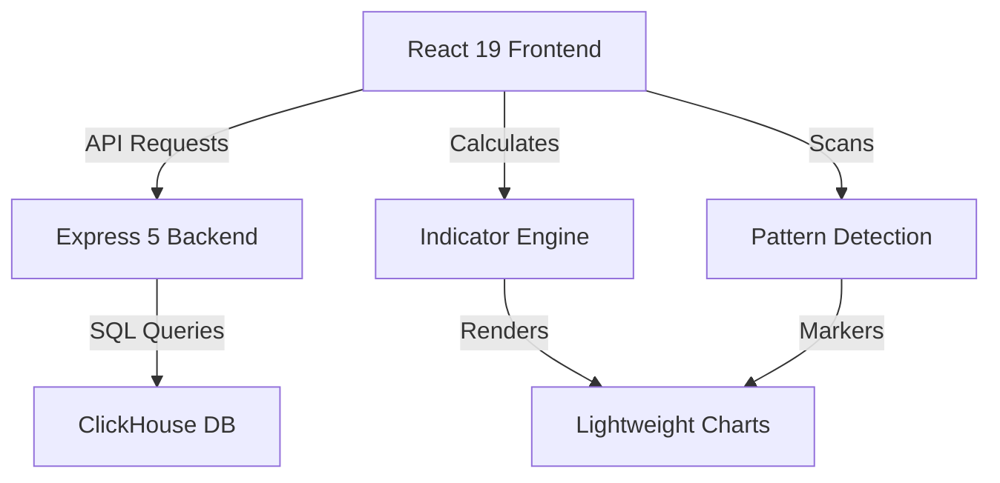

# ProTrader: Advanced Indian Stock Analysis Dashboard

A professional-grade, high-performance stock analysis platform specifically engineered for the Indian markets. ProTrader combines real-time data visualization, advanced technical intelligence, and a high-fidelity "Elite Trader" aesthetic.

## 🌌 Overview

ProTrader is more than just a charting tool; it's a full-stack analytical engine. It handles high-frequency time-series data via ClickHouse and performs multi-threaded technical analysis on the frontend to deliver instantaneous insights.

## 🚀 Key Features

### 1. High-Precision Charting
*   **Engine**: Powered by `lightweight-charts` (v5) for extreme performance and smooth interaction.
*   **Visuals**: Pure black high-contrast interface with neon-accents (Matrix/Cyberpunk aesthetic).
*   **Interactive Tooltip**: Real-time OHLC (Open, High, Low, Close) tracking with percentage change and price delta.
*   **Drawing Tools**: Integrated Horizontal Line (H-Line) creation for support/resistance tracking.

### 2. Massive Indicator Library (80+ Indicators)
Calculated in real-time on the client-side for maximum responsiveness:
*   **Moving Averages**: SMA, EMA, WMA, HMA, DEMA, TEMA, ALMA, VWMA, VWAP.
*   **Momentum**: RSI, MACD, Stochastic, StochRSI, CCI, ROC, Awesome Oscillator, Ultimate Oscillator, TSI, PPO.
*   **Volatility**: Bollinger Bands, ATR, Keltner Channels, Donchian Channels, Standard Deviation.
*   **Trend**: Parabolic SAR, ADX, Aroon, Supertrend, Vortex, Ichimoku Cloud.
*   **Volume**: OBV, Chaikin Money Flow (CMF), MFI, ADL, Elder Force Index.
*   **Advanced**: DPO, TRIX, Mass Index, Coppock Curve, KST, Elder Ray.

### 3. Smart Money Concepts (SMC) & Volume Profile
Automated detection of institutional market structure:
*   **BOS/CHoCH**: Real-time identification of Trend Continuations and Reversals.
*   **Order Blocks (OB)**: High-fidelity box drawing for institutional demand/supply zones.
*   **Volume Profile (VP)**: Vertical price-axis histogram with **Point of Control (POC)** highlighting.
*   **Signals**: Live "Futuristic" trade recommendations with Entry/Target/SL based on SMC logic.

### 4. Intelligence & News
*   **Real-time News**: Integrated with **NewsAPI.org** for live global and local market headlines.
*   **Sentiment Analysis**: Intelligence-coded markers (Bullish/Bearish) anchored directly to the price timeline.
*   **Intelligence Feed**: Dedicated sidebar panel for decrypting the latest market sentiment.

### 5. Professional Charting Suite
*   **Drawing Tools**: Advanced support for **Trendlines**, **Order Block Rectangles**, and **Horizontal Lines**.
*   **Ruler**: Measurement tool for price delta, time delta, and percentage moves.
*   **Persistent View**: Chart maintained its zoom level during indicator/pattern toggling for a smoother analysis workflow.

## 📂 Project Architecture



### Backend Structure
- **Entry Point**: `backend/index.js` (Server setup, CORS, Middleware).
- **Routes**: `backend/routes/stocks.js` (Endpoints for OHLC, Search, News, Trade Signals).
- **Services**:
    - `StockService`: High-speed ClickHouse integration via `@clickhouse/client`.
    - `NewsService`: Current implementation provides mock futuristic intelligence.
    - `TradeService`: Generates mock trade signals with confidence levels.
- **Config**: `backend/config/database.js` (ClickHouse connection pooling and connection test).

### Frontend Structure
- **Entry Point**: `src/main.jsx` -> `src/App.jsx` -> `src/components/Dashboard.jsx`.
- **Core Library**:
    - `src/lib/indicators.js`: Mathematical implementation of 80+ technical indicators.
    - `src/lib/patterns.js`: Mathematical detection for 38+ candlestick patterns.
- **Components**:
    - `CandlestickChart.jsx`: Specialized rendering logic for candles, indicators, and pattern markers.
    - `IndicatorPanel.jsx` / `PatternPanel.jsx`: Searchable registries for managing active overlays.

## 🔌 API & Integration

### Endpoints
*   `GET /health`: System health check (Status, Timestamp, Environment).
*   `GET /api/stocks/:symbol`: Fetch OHLCV data (parms: `timeframe`, `limit`).
*   `GET /api/stocks/search/all`: Fast search across `stocks_summary` table.
*   `GET /api/stocks/news/latest`: Latest market intelligence.
*   `GET /api/stocks/trades/futuristic`: Predictive trade signals.

### Security & CORS
- Backend implements dynamic CORS allowing `localhost` on any port and specific origins from `.env`.
- Connection pooling is used for ClickHouse to ensure scalable querying.

## ⌨️ Shortcuts & UX
- **Type Anywhere**: Instant symbol search activation.
- **`/`**: Focus search bar.
- **`Esc`**: Close modals/Clear search.
- **Crosshair**: Precision price/time tracking with synchronized sub-panes.

## 🛠️ Technology Stack
- **Frontend**: React 19, Vite, Tailwind CSS 4, Lightweight Charts 5.
- **Backend**: Node.js, Express 5.
- **Database**: ClickHouse.

## 🚧 Status & Performance
ProTrader is now in **Advanced Beta (Elite Edition)**. The platform features sub-second OHLCV retrieval and real-time frontend signal processing.

## 🎯 Next Steps (Roadmap)
- [x] **Phase 1**: Implement real-time NewsAPI integration.
- [x] **Phase 2**: Add SMC (BOS, CHoCH, OB) detection engine.
- [x] **Phase 3**: Add advanced drawing tools (Trendlines, Ruler, Rectangles).
- [ ] **Phase 4**: User Auth & Portfolio synchronization with live broker APIs.
- [ ] **Phase 5**: "Strategy Builder" — A GUI for creating custom alerts.
- [ ] **Phase 6**: WebSocket support for sub-second live streaming.

## 🚦 Getting Started

1.  **ClickHouse**: Ensure ClickHouse is running (`localhost:8123`).
2.  **Environment**: Create `.env` in root and `/backend` (refer to `.env.example`).
3.  **Install & Run**:
    ```bash
    # Root (Frontend)
    npm install && npm run dev
    
    # Backend
    cd backend && npm install && npm run dev
    ```

---
**SECURE UPLINK ESTABLISHED | PROTRADER v5.0 | INDIA REGION**

